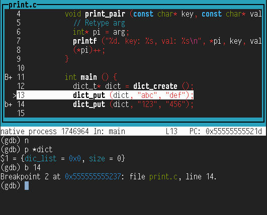

## 1. Lab Assignment 2 Dict Lab

Most of the C programming you have seen to date pertains to memory representation of objects. In this lab, you will be using C as a full-featured language and implement a dictionary application. This project also introduces some topics that will be covered throughout the session (indicated using “Ch. X” in this text and referring to the chapters of our main textbook).

A sample usage of the dictionary application is as follows; in all the examples, lines starting with `$` denote the commands typed in the shell, and with `>` those typed in `dict`, your program:

```shell
$ make
make[1]: Entering directory '/home/aorhean/csc-374-lab2-aorhean/src'
gcc -g -Wall -Werror   -c -o dict.o dict.c
gcc -g -Wall -Werror   -c -o main.o main.c
gcc   dict.o main.o  -lmcheck  -o dict
make[1]: Leaving directory '/home/aorhean/csc-374-lab2-aorhean/src'
$ src/dict
> put word:definition
> get word
definition
> put word:changed definition
> get word
changed definition
> del word
> get word

> CTRL-d
goodbye.
$
```

> **Note:** Typing CTRL-d signals to your program that the input that it is reading (from the “standard input”) has reached the *end of file*. Your program should end gracefully when reaching the end of the commands.

This will rely on a dictionary library that you will implement. The above interaction corresponds to the following code with the library:

```c
dict_t* dict = dict_create ();
dict_put ("word", "definition");

char* def = dict_get ("word");
if (def != NULL)
  write (STDOUT_FILENO, def, strlen (def));
write (STDOUT_FILENO, "\n", 1);

dict_put ("word", "changed definition");

def = dict_get ("word");
if (def != NULL)
  write (STDOUT_FILENO, def, strlen (def));
write (STDOUT_FILENO, "\n", 1);

dict_del ("word");

def = dict_get ("word");
if (def != NULL)
  write (STDOUT_FILENO, def, strlen (def));
write (STDOUT_FILENO, "\n", 1);

dict_destroy (dict);
```

This project is divided into three parts and a bonus part:

- **Part 1.** You will be implementing a dictionary structure (storing pairs key/value), and reading the user input to manipulate the structure. The commands implemented in that stage are `put`, `get`, and `del`. It will be important not to leak any memory in these functions.
- **Part 2.** You will add two more commands: `clr`, which clears the dictionary, and `siz`, which prints the size of the dictionary. Again, `clr` will have to make sure not to leak any memory. You will also implement a *destructor* for your dictionary object.
- **Part 3.** You will add three more commands: `dmp`, which dumps the entire dictionary on the output, `ldf`, which loads a file containing dictionary entries, and `svf`, which saves the current dictionary in a file. Also, in Part 3, the executable will be taking files as argument, and load them.
- **Bonus part.** If you implement your dictionary with a (double) linked list, its performance will not be great. In the Bonus part, you will earn points by providing a faster implementation of dictionaries.

## 2. Downloading the assignment

Start by accepting the GitHub Assignment by clicking on the invitation link from the assignment description on D2L. Then clone your repository in your home directory on the **matrix.cdm.depaul.edu** machine:

```shell
$ cd ~/
$ git clone git@github.com:transcendental-software/csc-374-lab2-USER.git
```

This will cause a number of files to be unpacked into the directory. *You should only modify the files `src/main.c` and `src/dict.c`, and these are the only files that are submitted.* The `tests` folder contains the different tests and grading examples for your program. Use the `make` command to compile your code and the command `make test` to run the test driver. This would run all the tests for all three parts, which is not really useful while working; see Section 8.2 for more finely grained testing options.

## 3. Structure of the project

There are two distinct aspects to that project, that are made clear by the fact that you will code in two different files in the `src/` folder: `main.c` and `dict.c`. The file `dict.c` will implement a *dictionary library*, which creates and manages a data structure for key/value pairs. The file `main.c` will be in charge of providing the user interface: read the commands, execute them using the dictionary library, and print the results to the user.

The two parts are independent in the sense that the library does not depend on the user interface (it could be reused in other projects) and the user interface could use any implementation of the library interface (spelled out in `dict.h` which you are not allowed to modify). The file `main.c` is in no way allowed to access the dictionary structure through any means other than the library functions that you will implement.

The dictionary library will have to define a dictionary type `dict_t` and implement the following functions (listed in `dict.h` and to be implemented in `dict.c`):

```c
// Create a dictionary.
dict_t* dict_create ();

// Free a dictionary.
void    dict_destroy (dict_t* dic);

// Put an element in a dictionary.  key is case sensitive, val is a string.  If
// the key already exists, its value is updated.  If val is NULL, the pair is
// deleted.
void    dict_put (dict_t* dic, const char* key, const char* val);

// Return the value associated with key, or NULL if none.
char*   dict_get (const dict_t* dic, const char* key);

// Delete the pair associated with key.
void    dict_del (dict_t* dic, const char* key);

// Return the size of the dict.
size_t  dict_size (const dict_t* dic);

// Delete all elements in a dictionary.
void    dict_clear (dict_t* dic);

// Apply fun to each pair key/val; arg is an extra argument passed to fun.
void    dict_apply (const dict_t* dic, const dict_apply_fun_t fun, void* arg);
```

The user interface, implement in `main.c`, starts with an empty dictionary and will have to be able to interpret the following commands:

- `put KEY:VALUE`: assign `VALUE` to `KEY` in the dictionary.
- `get KEY`: return the value associated with `KEY`.
- `del KEY`: delete the pair associated with `KEY`.
- `siz`: print the size of the dictionary.
- `clr`: empty the dictionary.
- `ldf`: load an extra dictionary from a file.
- `dmp`: dump the current dictionary on the standard output.
- `svf`: save the current to a file.

## 4. Part 1: `get`, `put`, `del`

### 4.1. Dictionary library (`dict.c`)

In Part 1, you will have to implement the bulk of the dictionary library in `dict.c`.

#### 4.1.1. Dictionary structure

You will start by giving a definition for your main structure `struct dict`. (You cannot change the name of this type, it is however aliased (`typedef`’d) in `dict.h` as `dict_t` to avoid having to type `struct` each time.)

For instance, you may want to have a dictionary implemented as a linked list; in that case, you can store the head of that list and its length in your structure:

```c
struct dict {
    struct dict_list* head;
    size_t size;
};
```

The first field is a *pointer* (`*`) to the head of the list, that is, its memory address. The `struct dict_list` itself contains the key, the value, and the address of the next element in the list:

```c
struct dict_list {
    char* key;
    char* val;
    struct dict_list* next;
};
```

The end of the list is signaled by having `next` be `NULL`.

> **Note:** The definition of `struct dict_list` should appear *before* `struct dict` since the latter uses the former. C compilers read files from top to bottom and it is sometimes forcing illogical presentation of the code—but there is a way out: [*forward declarations*](https://en.wikipedia.org/wiki/Forward_declaration). For example, let’s assume that you want your `main` function to be at the top of your `main.c` file (it’s a matter of taste after all). However, your `main` function uses say a function `execute_command` which is also defined in `main.c`. To avoid having the code of `execute_command` before `main`, you can simply indicate to the compiler that there *will* be such a code later on. You do this by just repeating the function’s type, with no code, before `main`:
>
> ```c
> // Forward declaration.
> void execute_command (const char* cmd);
>
> int main (int argc, char** argv) {
>   ...
>     }
>
> void execute_command (const char* cmd) {
>   // Actual code
> }
> ```
>
> This is in fact what happens with C *header files*: they only contain the *declarations* of functions, but the code appears in other files. These forward declarations are further resolved during *linking* (Ch. 7).

#### 4.1.2. `dict_create`

Equipped with these structures, start by implementing:

```c
dict_t* dict_create ();
```

This function should allocate a new structure of type `dict_t` (aka `struct dict`), initialize its members, and return the newly allocated structure. To do so, you will call `malloc` to allocate a sufficient amount of memory:

```c
dict_t* ret = malloc (sizeof (dict_t));
```

Then, you should initialize the fields of `ret`. Since `ret` is a pointer, to access the object it points to, you should use `*ret`; hence the `size` field is accessed using `(*ret).size`. C has a shorthand notation for this very common construct:

```c
ret->size = 0;
```

Now make sure to initialize `head` (since its value is garbage as it was just allocated) and you are done and can return `ret`.

You will be implementing `dict_destroy` in Part 2; this is the function that will be in charge of freeing the memory that was just allocated: in C, memory that is `malloc`’d is never automatically freed. Memory allocation is the topic of Ch. 9.

#### 4.1.3. `dict_get`

Next, you will implement:

```c
char* dict_get (const dict_t* dict, const char* key);
```

This function goes through the list given by `dict`. If you use the above structure, this means starting at `el = dict->head` and checking each time whether the key at `el` is `key`; if it is not, we set `el = el->next`, until either `key` is found, or we reach `el == NULL`.

To compare `key` with `el->key`, we need to compare one by one each character in `key` with those in `el->key`. Remember that strings in C are just *pointers* (memory addresses) to the first character in the string, so comparing `el->key == key` will *not* do what you want. So how do you even get the length of a string `s`? You would start at memory location `s` and advance as long as the byte at `s` (i.e. `*s`) is not the *end-of-string marker* (`\0`, the `NULL` character). This can get a bit messy, so luckily, you are allowed to use the string comparison function `strcmp(3)` provided by the standard library:

- `strcmp (s1, s2)`: returns 0 iff `s1` and `s2` are the same strings. Hence in `if (strcmp (s1, s2))...`, the condition holds if the strings are *different*—be careful.

If `key` is found, return the corresponding value; otherwise, return `NULL`.

> **Note:** You will remark that the type of the argument `dict` is not simply `dict_t*` but `const dict_t*`. This is used to indicate to the compiler that the function `dict_get` guarantees that it won’t modify the contents of `dict` (that is, `*dict`). These indications are crucial to providing clear contracts to the user, helping the compiler make correct assumptions, and avoiding modifying objects you did not intend to modify.

#### 4.1.4. `dict_put`

It is now time for:

```c
void    dict_put (dict_t* dict, const char* key, const char* val);
```

This function stores the pair `key` / `val` in the dictionary `dict`, possibly erasing the previous value associated with `key`.

It should *make private copies* of `key` and `val` as required. This means that the function cannot use, for instance, `my_element->val = val`. To make a copy of a string `s`, one could:

1. allocate `strlen(s) + 1` bytes using [`malloc(3)`](https://man7.org/linux/man-pages/man3/malloc.3.html) ([`strlen(3)`](https://man7.org/linux/man-pages/man3/strlen.3.html) returns the length of a string, not counting the end-of-string marker)
2. go through the `strlen(s) + 1` bytes of `s` and copy each byte, using either a loop or the function [`memcpy(3)`](https://man7.org/linux/man-pages/man3/memcpy.3.html)

Again, the standard library provides a function for this: [`strdup(3)`](https://man7.org/linux/man-pages/man3/strdup.3.html)—remember that since its return value was `malloc`’d, it needs to be `free`’d.

The function works as follows:

- If `key` is found in `dict`, then the associated value should be freed and replaced by a copy of `val`.
- If `key` is not found in `dict`, then a new element is added to the list; that element’s key is a copy of `key` and its value is a copy of `val`.

#### 4.1.5. `dict_del`

Finally, you should implement:

```c
void    dict_del (dict_t* dict, const char* key);
```

This function goes through `dict` searching for `key`, if it finds it, it should delete the corresponding key/value pair. The memory allocated for the element and its key/value pair should be `free`’d. If the key does not exist, this function does nothing.

### 4.2. User interface (`main.c`)

The `main` function will contain the main loop of your program and should behave like this:

1. Create an empty dictionary
2. Print `"> "` on the standard output (*this is important*).
3. Read the command from the user; the first three characters are the command name, then a space, then the arguments, and a newline character `\n`.
4. If the command is unknown, exit.
5. If end-of-file was read (EOF), destroy the dictionary and exit.
6. Otherwise, execute the corresponding command and go back to 2.

To write to the standard output, you will be using [`write(2)`](https://man7.org/linux/man-pages/man2/write.2.html). You are not allowed to use [`printf(3)`](https://man7.org/linux/man-pages/man3/printf.3.html).

> **Note:** In Part 3, you will be dealing with reading and writing from files. In fact, the standard input and standard output *are* files. For instance, `printf` is simply a shortcut for `fprintf (stdout, ...)`, and `stdout` is an internal object of the standard library that points to file descriptor `0`, the standard output. On UNIX machines, the standard input and output are accessible as “fake” files, located in `/dev`; since these are per-process (each process has its own standard input/output), when accessing the file `/dev/stdout`, the kernel checks which process is accessing them and returns the correct file descriptor.

> **Note:** The functions [`fprintf(3)`](https://man7.org/linux/man-pages/man3/fprintf.3.html), [`printf(3)`](https://man7.org/linux/man-pages/man3/printf.3.html), [`fopen(3)`](https://man7.org/linux/man-pages/man3/fopen.3.html), … that we will see later in Systems 2 are *buffered*: since actually reading and writing to a file is very costly (it requires a system call, Ch. 8), these actions are done in temporary buffers in memory, and system calls are made only when needed (buffer full when writing, buffer empty when reading). We will see more about buffering in Ch. 10. For the moment, we will rely on the basic, system level I/O functions [`read(2)`](https://man7.org/linux/man-pages/man2/read.2.html), [`write(2)`](https://man7.org/linux/man-pages/man2/write.2.html), [`open(2)`](https://man7.org/linux/man-pages/man2/open.2.html), … Note that these are indeed system level, since they are in man section 2.

#### 4.2.1. Commands

The three commands to be implemented in this part are:

- `get KEY`: print the value associated with `KEY` followed by a newline `\n`. If no such value exists, a blank line is printed.
- `put KEY:VALUE`: store the pair `KEY` / `VALUE`. Note that both `KEY` and `VALUE` can be arbitrary strings, with the only guarantee being that `KEY` does not contain a colon. Additionally, these strings don’t contain a newline `\n`. Nothing is printed in return.
- `del KEY`: delete the pair associated with `KEY`, if it exists. Nothing is printed in return, even if the key does not exist in the dictionary.

## 5. Part 2: `clr`, `siz`

### 5.1. Dictionary library (`dict.c`)

#### 5.1.1. `dict_clear`

You will implement the function:

```c
void dict_clear (dict_t* dict);
```

This function clears the dictionary `dict`, destroying each pair key/value, but does not destroy `dict` itself (remember that `dict` was allocated using `dict_create`, so it will need to be freed at some point, but this is not this function’s job.)

In practice, if you use a linked-list implementation, you will start at `dict->head` and free each `key` and `val`, then free the `dict_list` object itself, before going to the next element. It is strongly recommended that you do *not* implement this recursively. By saving the `next` pointer before freeing the element, you will make sure that you are not trying to access a field in a destroyed variable.

> **Note:** When you `free` a memory location, the memory is usually not overwritten, but simply put in a pool of “available” memory. This means that if you try to access that memory, your data is usually still there. This may hide bugs and create very random crashes. To avoid this, your program is compiled with `-lmcheck`; as a result, a different implementation of `malloc` and `free` is used which makes sure that your program crashes if you try to access a memory location that has been freed. We will see more of this in Ch. 9.

#### 5.1.2. `dict_destroy`

This is now the function that frees (destroys) a dictionary:

```c
void dict_destroy (dict_t* dict);
```

This operates just as `dict_clear`, but in addition should free the memory that was allocated during `dict_create`. After a call to this function, if any other library function receives the pointer `dict`, the behavior is undefined (most likely, it will crash).

> **Note:** You may be tempted to set `dict` to `NULL` at the end of that function, hoping that this will make it clear to the user that the pointer is now invalid. However, changing the value of `dict` in `dict_destroy` will have no impact on the value of `dict` outside of the function. This is because in C, arguments are always [passed by value](https://en.wikipedia.org/wiki/Evaluation_strategy#Call_by_value), that is, the value of the argument is copied when making the call. This is also why we *never* pass a `struct` as argument to a function: we want to avoid copying the whole structure when making the call. Additionally, passing a pointer to a `struct` allows the called function to modify the fields in a way that the caller will see.

#### 5.1.3. `dict_size`

This simple function returns the current size of the dictionary:

```c
size_t dict_size (const dict_t* dict);
```

> **Note:** The type `size_t` is a standard alias for `unsigned long`, that is, a 64-bit unsigned integer type. It is defined in the header file `stddef.h`, which is included by most standard headers (e.g., `unistd.h`, `stdio.h`, …).

### 5.2. User interface (`main.c`)

Two new commands should now be made available:

- `clr`: clear the dictionary. Nothing is printed in return.
- `siz`: print the current size of the dictionary.

The only difficulty here is that your previous commands had argument(s), while these two have none. Here is an example run:

```shell
$ src/dict
> put a:b
> siz
1
> put a:c
> siz
1
> get a
c
> clr
> siz
0
> get a

>
```

Also, now that `dict_destroy` is available, your program is expected to call it when finishing treating the input. Consequently, your program should have no memory leaks.

## 6. Part 3: `dmp`, `ldf`, `svf`

In this part, you will be interacting with files, allowing the user to save to file (`svf`) and load from file (`ldf`). The command `dmp` will dump the whole dictionary on the standard output; this can be seen as “saving” to the standard output. The dictionary library is not concerned with files, this is the role of the user interface in `main.c`; however, the dictionary library should offer a way to go through all the elements on the dictionary.

### 6.1. Dictionary library (`dict.c`)

In `dmp` and `svf` you will have to go through the whole dictionary. At this point, there is no way for `main.c` to do so; as is the point of most libraries, the implementation details in `dict.c` are hidden to the user (in our case, `main.c`), so it is not possible for `main.c` to go through the list stored in a `dict_t`.

> **Note:** When `main.c` is compiled, the only information it has about the type `dict_t` is given by `dict.h`, since C files are compiled separately before being *linked* (Ch. 7). When compiling `main.c`, the compiler only knows about the forward declaration of the type:
>
> ```c
> typedef struct dict dict_t;
> ```
>
> If you tried dereferencing a variable of type `dict_t*` in `main.c`, you would obtain the error:
>
> ```
> error: invalid use of incomplete typedef ‘dict_t’ {aka ‘struct dict’}
> ```
>
> Crucially, the compiler does not know what is the size of an object of type `dict_t`, since it does not know what are its fields (the full type, with, e.g., `next`, `val`, `key`, is only declared in `dict.c`). So how come using `dict_t*` is fine? This is because this is a *pointer* type, hence its size is just the size of any pointer (64 bits). However, if you were to use *pointer arithmetic*, this would also fail; with `dict++` in `main.c`, the error would read:
>
> ```
> main.c: error: increment of pointer to an incomplete type ‘dict_t’ {aka ‘struct dict’}
> ```
>
> This is because pointer arithmetic depends on the size of the *pointed* object:
>
> ```c
> uint32_t*  i = NULL;
> uint64_t*  l = NULL;
> printf ("%p + 1 == %p, %p + 1 == %p", i, i + 1, l, l + 1);
> // -> "(nil) + 1 == 0x4, (nil) + 1 == 0x8"
> ```

#### 6.1.1. `dict_apply`

This function has the (nontrivial) type:

```c
void dict_apply (const dict_t* dict, const dict_apply_fun_t fun, void* arg);
```

For each pair `key` / `value` in `dict`, it will call the function `fun` with arguments `(key, value, arg)`. This is a type of “for each” loop (or map)), showing that C is well capable of using advanced programming concepts, albeit with a somewhat contrived syntax. The type `dict_apply_fun_t` is the interesting part here:

```c
typedef void (*dict_apply_fun_t) (const char* key, const char* val, void* arg);
```

This defines a type `dict_apply_fun_t` as “pointer to a function that returns `void` and takes two arguments of type `const char*` and one of type `void*` (untyped pointer)”. Indeed, *functions have addresses* (more on that in Ch. 7), so one can talk about *pointers to functions*. To call the function pointed at by `fun`, one can use a normal function-call syntax (`fun (key, value, arg)`) or dereference the pointer first (`(*fun) (key, value, arg)`)—this is a matter of taste.

In the following example (`print.c`), we create a dictionary, put a few things in it, then call `dict_apply` to print all the values in the dictionary. We use the extra argument `arg` to count the number of elements. We need to retype `arg` since `dict_apply` demoted its type to a generic pointer `void*`.

```c
#include <stdio.h>
#include "dict.h"

void print_pair (const char* key, const char* val, void* arg) {
  // Retype arg
  char* pref = arg;
  write (STDOUT_FILENO, pref, strlen (pref));
  write (STDOUT_FILENO, "(", 1);
  write (STDOUT_FILENO, key, strlen (key));
  write (STDOUT_FILENO, ",", 1);
  write (STDOUT_FILENO, val, strlen (val));
  write (STDOUT_FILENO, ")\n", 2);
}

int main () {
  dict_t* dict = dict_create ();
  dict_put (dict, "abc", "def");
  dict_put (dict, "123", "456");

  char* pref = ">>>";
  dict_apply (dict, &print_pair, pref);
}
```

Next we compile this with our dictionary library and run it:

```shell
$ gcc -c -Wall print.c
$ gcc -c -Wall dict.c
$ gcc print.o dict.o -o print
$ ./print
>>>(abc,def)
>>>(123,456)
```

**Note** that the order in which these are printed depends on your underlying implementation and **any order is valid.**

### 6.2. User interface (`main.c`)

You will be using files for saving and loading dictionaries. For this, we will use the standard library, in which the “file object” is a pointer to a structure that you manipulate using some functions. This follows the pattern we’ve been using for the dictionary library: users do not know what is in that structure and only access it through an interface.

#### 6.2.1. `dmp`

This command does not manipulate files; it simply dumps the dictionary to the standard output. It should start by printing `BEGIN_DUMP`, then all the pairs `key:value` separated by newlines, then `END_DUMP`:

```shell
> put abc:def
> put 123:456
> dmp
BEGIN_DUMP
abc:def
123:456
END_DUMP
>
```

To implement this, refer to the example file `print.c` in Section 6.1.2. The order in which the elements are printed is not important (it depends on how you implemented your dictionary).

#### 6.2.2. `svf FILE`

The command `svf FILE` dumps the content of the dictionary in a file, then prints the message `SAVED` when done:

```shell
> put abc:def
> put 123:456
> svf /tmp/test.txt
SAVED
> CTRL-d
goodbye.
$ cat /tmp/test.txt
abc:def
123:456
$
```

In the following example, we open a file for writing (`O_WRONLY`), write using `write (fd, str, len)`, and close the file:

```c
int fd = open ("testtt", O_WRONLY | O_CREAT | O_TRUNC, 0600);
if (fd < 0)
  error ("could not open %s for writing\n", filename);
char* txt = "Hello world!";
write (fd, txt, strlen (txt));
close (fd);
```

You will also be using `dict_apply` for this; this time however, the extra argument `arg` will prove useful: this will be used to store the file descriptor variable.

> **Note:** The `O_TRUNC` option of `open(2)` truncates the file to zero length if it existed. Using `O_WRONLY | O_CREAT | O_APPEND` would append (see the man page for more). However, opening and closing files are expensive operations, so `svf` should avoid opening and closing the file for *each* pair key/value. As suggested, it should first open the output file, then call `dict_apply` to write the dictionary data to the file descriptor passed as argument, and finally close the file.

> **Note:** Make sure you close the file descriptor you are writing <ins>before</ins> printing `SAVED`. The driver (or any user) could be acting *very* fast after `SAVED`, try to read the file that was saved, and chaos can ensue since the kernel may have not flushed all the data to the disk.

#### 6.2.3. `ldf FILE`

The command `ldf FILE` adds the key/value pairs stored in the file `FILE` to the dictionary and prints `LOADED` when done. As with `put`, if the key already exists, its value is overwritten:

```shell
$ cat /tmp/test.txt
abc:def
123:456
$ src/dict
> put 123:numbers
> put xyz:letters
> ldf /tmp/test.txt
LOADED
> dmp
BEGIN_DUMP
123:456
xyz:letters
abc:def
END_DUMP
>
```

To open a file for reading, use `O_RDONLY` as the second argument of [`open(2)`](https://man7.org/linux/man-pages/man2/open.2.html); in the following example, we open `filename` for reading and check if we can read one character:

```c
int f = open (filename, O_RDONLY);
if (f < 0)
  error ("could not open %s for reading\n", filename);
char c;
if (read (f, &c, 1) == 0)
  ; // EMPTY FILE!
close (f);
```

In your implementation, rather than just reading one character, you will repeatedly read each line of `f`, split that line at the colon, and call `dict_put` to populate the current dictionary.

**In addition,** your program should now be able to take arguments that are files that should be loaded *silently* at the beginning of the execution:

```shell
$ cat /tmp/test.txt
abc:def
123:456
$ src/dict /tmp/test.txt
> dmp
BEGIN_DUMP
abc:def
123:456
END_DUMP
```

The number of such files passed in argument is not limited.

> **Note:** We’ve seen the *standard input* as a way to interact with your program. Another, more elementary way, is through program arguments as above. Your `main` function takes two arguments:
>
> ```c
> int main (int argc, char* argv[])
> ```
>
> The first one indicates the number of arguments to your program (in fact, plus one, since the first “argument” is the program name). The second argument is an array of `char*` (i.e., of strings) that contains each argument. Refer to the Basics of C for examples of use.

## 7. Bonus Part

For extra bonus point, you can implement a data structure that is more efficient than (double) linked lists. Linked lists have terrible performances: when searching for an element that is not in the dictionary you need to go through all pairs key/value.

Tweaking your `dict_put` to ensure that the list is always sorted by keys does provide a speedup, but of only 30%, which is still much too slow. By *sorted* here, we mean according to the return value of [`strcmp(3)`](https://man7.org/linux/man-pages/man3/strcmp.3.html). Indeed, this function does more than just checking whether two strings are equal:

- If `strcmp (a, b) < 0`, then `a` would appear before `b` in a real-life dictionary;
- If `strcmp (a, b) > 0`, then `a` would appear after `b` in a real-life dictionary.

You can score most bonus points with a simple [binary search tree](https://en.wikipedia.org/wiki/Binary_search_tree) based on this order. The idea is to have a binary tree where each node stores a pair key/value. The nodes to the left of a given node contain keys that are smaller, while the nodes to the right contain keys that are greater (according to the order given by [`strcmp(3)`](https://man7.org/linux/man-pages/man3/strcmp.3.html)).

To search for a key, we start at the root, and check the return value of `strcmp`: if it is `0`, we found the key; if it is negative, the key may be in the left subtree but not the right; if it is positive, the key may be in the right subtree but not the left. To insert a new pair, one would go down the tree as if to search for the pair’s key and insert the new pair at a leaf. To delete a pair, one would for instance replace the pair with its left subtree, and put its right subtree as the leftmost child of the right subtree of its parent. Refer to your data structures textbook for more details.

Implementing binary search trees provides a speedup of around 82% (what takes 60 seconds with a linked list takes about 1 second with a binary search tree). Since the benchmark files are random, binary search trees perform nearly as well as more complex balanced version that you may have seen in Data Structures II.

## 8. Evaluation

### 8.1. Points

The parts are graded as follows:

- **Parts 1**: 100 points
- **Parts 2, 3**: 100 points each, 20 of which are for lack of memory leaks
- **Bonus part**: 100 points, proportional to performances

You are **not** allowed to use the functions [`strtok(3)`](https://man7.org/linux/man-pages/man3/strtok.3.html), [`fscanf(3)`](https://man7.org/linux/man-pages/man3/fscanf.3.html), [`sscanf(3)`](https://man7.org/linux/man-pages/man3/sscanf.3.html), [`strchr(3)`](https://man7.org/linux/man-pages/man3/strchr.3.html), [`strstr(3)`](https://man7.org/linux/man-pages/man3/strstr.3.html), [`memchr(3)`](https://man7.org/linux/man-pages/man3/memchr.3.html), `strsep(3)`, and similar string-searching functions.

### 8.2. Driver

This project is evaluated by a test driver. You can run the full driver by typing, at the root of your project:

```shell
$ make test
```

This makes sure that your program is compiled with the latest sources, moves to the directory `tests`, and runs the driver `./driver.sh`.

As you work on each successive parts, you may want to run the driver on each part separately and on smaller test files:

```shell
$ cd tests/
$ ./driver.sh -h
usage: ./driver.sh [-s] [-P PART]...
Grade the dictlab.
  -s            Use short tests (not for grading).
  -P PART       Grade only part PART (1, 2, 3, B).  Default is all.
$ ./driver.sh -s -P 1
* PART 1
[OK] ../src/dict < ./traces/short-P1-01.txt
  ...
[OK] ../src/dict < ./traces/short-P1-20.txt
[OK] Checking memory leaks on previous test with valgrind
PART 1  100 / 100
FINAL  100 / 100
$
```

For each test, the driver prints what is the command executed. For instance, the command:

```shell
$ ../src/dict < ./traces/short-P1-01.txt
```

runs `../src/dict` and executes the commands found in `./traces/short-P1-01.txt`.

The result, for each test, is readily printed; in bracket, there’s a shorthand notation for the result:

- `OK`: Test passed
- `KO`: Test failed, your `dict` printed something unexpected
- `TO`: Time out, your `dict` took too long to answer, it’s usually caused by an infinite loop. See Section 9.1 for more on how to debug time outs.
- `MM`: Memory problem, your `dict` made an illegal memory access (or other similar errors, as printed.) Valgrind will list the line in which the problem occurred. See Section Valgrind for more on Valgrind on how to debug memory problems.

> **Note:** The driver is executed from the `tests` directory, hence to access the `dict` executable, it needs to call it as `../src/dict`, which means “go to the parent directory, then to the `src` directory, then find `dict`.”

> **Note:** The driver uses commands found in a text file. To provide them to `dict`, it replaces the standard input of `dict` with the file. This is done, in a shell, using the redirection `<`. For instance, the program [`cat(1)`](https://man7.org/linux/man-pages/man1/cat.1.html) reads files passed as argument and prints them as-is. If no argument is provided, `cat` will read from its standard input:
>
> ```shell
> $ cat
> hello  ← typed by user
> hello  ← printed by cat
> CTRL-d
> $
> ```
>
> Hence using `cat /tmp/test.txt` and `cat < /tmp/test.txt` do exactly the same thing: they print `/tmp/test.txt`. In the first case, `cat` reads the file provided as argument, in the second, the shell redirects the contents of `/tmp/test.txt` to the standard input of `cat`. We will see how the shell does this in Ch. 10. Can you guess what `cat /dev/stdin < /tmp/test.txt` do?

## 9. Tools

### 9.1. GDB

You should be fairly familiar with GDB at this point, but here are a few tips.

- Run your program with arguments or with a redirection:

  ```shell
  (gdb) r arg1 arg2 < file1
  ```

  This will run your program with arguments `arg1 arg2` and replace the standard input with `file1`. To silence the output of your program, you can add `> /dev/null` to that command line.

- Print variables:

  ```shell
  (gdb) p *dict
  $1 = {head = 0x0, size = 0}
  (gdb) p dict->size
  $2 = 0
  ```

  The command `p` can print a lot of objects. It is not limited to variables, as you can call functions with arguments:

  ```shell
  (gdb) p (int) strlen ("lorem")
  $3 = 5
  ```

- Put/delete/list breakpoints:

  ```shell
  (gdb) b main
  Breakpoint 1 at 0x1150: file main.c, line 63.
  (gdb) b main.c:77
  Breakpoint 2 at 0x1276: file main.c, line 77.
  (gdb) d 2
  (gdb) info b
  Num     Type           Disp Enb Address            What
  1       breakpoint     keep y   0x0000000000001150 in main at main.c:63
  ```

- Continue from a break point:

  ```shell
  Breakpoint 1, main (argc=1, argv=0x7fffffffe078) at main.c:63
  63      int main (int argc, char** argv) {
  (gdb) c
  ```

  With a numeric argument, `c` will skip the next crossings:

  ```shell
  (gdb) c 3
  Will ignore next 2 crossings of breakpoint 1.  Continuing.
  ```

  The command `until` can be used to continue *until* a certain line is reached:

  ```shell
  (gdb) until main.c:72
  main (argc=<optimized out>, argv=<optimized out>) at main.c:72
  ```

- Stepping into/over, finishing a call:

  ```shell
  Breakpoint 5, cmd_del (dict=0x55555555a2f0) at main.c:151
  151       dict_del (dict, del_arg);
  (gdb) s
  dict_del (dic=0x55555555a2f0, key=0x55555555abc0 "x") at dict.c:275
  ```

  The command `s` steps *into* a call.

  ```shell
  Breakpoint 5, cmd_del (dict=0x55555555a2f0) at main.c:151
  151       dict_del (dict, del_arg);
  (gdb) n
  152       free (del_arg);
  ```

  The command `n` steps *over* calls. When in a function, the command `finish` completes the call, hence `s` followed by `finish` is the same as `n`:

  ```shell
  Breakpoint 5, cmd_del (dict=0x55555555a2f0) at main.c:151
  151       dict_del (dict, del_arg);
  (gdb) s
  dict_del (dic=0x55555555a2f0, key=0x55555555abc0 "x") at dict.c:275
  275       dict_list_t* el = dict_find_elt (dic, key);
  (gdb) finish
  Run till exit from #0  dict_del (dic=0x55555555a2f0, key=0x55555555abc0 "x") at dict.c:275
  cmd_del (dict=0x55555555a2f0) at main.c:152
  152       free (del_arg);
  ```

- Looking up and down the call stack:

  ```shell
  Breakpoint 5, cmd_del (dict=0x55555555a2f0) at main.c:151
  151       dict_del (dict, del_arg);
  (gdb) s
  dict_del (dic=0x55555555a2f0, key=0x55555555abc0 "x") at dict.c:275
  275       dict_list_t* el = dict_find_elt (dic, key);
  (gdb) bt
  #0  dict_del (dic=0x55555555a2f0, key=0x55555555abc0 "x") at dict.c:275
  #1  0x00005555555559ab in cmd_del (dict=0x55555555a2f0) at main.c:151
  #2  0x0000555555555276 in main (argc=<optimized out>, argv=<optimized out>) at main.c:75
  (gdb) up
  #1  0x00005555555559ab in cmd_del (dict=0x55555555a2f0) at main.c:151
  151       dict_del (dict, del_arg);
  (gdb) down
  #0  dict_del (dic=0x55555555a2f0, key=0x55555555abc0 "x") at dict.c:275
  275       dict_list_t* el = dict_find_elt (dic, key);
  ```

  In this example, we first step into `dict_del`, then print the call stack (`bt` standing for backtrace). Then we move around the call stack using `up` and `down`; note that this does not change the current instruction, we are just visiting the call stack.

- History: Use the Up and Down arrow keys to navigate your history, which is persistent across sessions. To search for something you typed recently, hit CTRL-r:

  ```shell
  (gdb) r very long command line carefully crafted < input > output
     ...
  (gdb) CTRL-r and typing "r v"
  (reverse-i-search)`r v': r very long command line carefully crafted < input > output
  ```

- Graphical interface. That’s right, GDB has a very nice user interface:

  

  To access the interface, type `tui enable` (`tui` stands for [Text User Interface](https://sourceware.org/gdb/onlinedocs/gdb/TUI.html)). In that mode, the arrow keys move up and down the code, while CTRL-p and CTRL-n behave like your usual history keys. If you print things in your program, this *will* garble the output of GDB; you can either refresh the GDB window by typing CTRL-l, or run your program with `> /dev/null` (see first GDB tip).

> **Note:** To debug timeouts (`TO`), hence likely infinite loops, start by running the driver on short traces (`./driver.sh -s`) and look at a trace that times out:
>
> ```shell
> $ cd tests
> $ ./driver.sh -s -P 1
> * PART 1
> [TO] ../src/dict < /home/prof/.../traces/short-P1-01.txt
>   CTRL-c
> $ cat /home/profs/.../traces/short-P1-01.txt
> put a:b
> ...
> ```
>
> You can then reproduce the trace line by line.
>
> If short traces do not create a time out, you should do the same thing as above with a long trace, but in GDB. You can then stop GDB using CTRL-c, and see where it is stuck:
>
> ```shell
> $ make test
> * PART 1
> [TO] ../src/dict < /home/prof/.../traces/grading-P1-01.txt
> CTRL-c
> $ gdb src/dict
> (gdb) r < /home/prof/.../traces/grading-P1-01.txt > /dev/null
>   CTRL-c
> (gdb) bt
> ```

### 9.2. Valgrind

[`valgrind(1)`](https://man7.org/linux/man-pages/man1/valgrind.1.html) is a complete suite of tools for debugging and profiling programs. Out of the box, `valgrind` checks whether a given program makes illegal memory accesses or leaks memory. To use it like that, we simply prefix the command line with `valgrind`. Consider the following program:

```c
int main () {
  char *s = malloc (10);
  s[10] = 'a';
}
```

This program has two problems: It doesn’t free the allocated memory and it does an illegal memory access (`s[10]` being out of bound). Valgrind clearly reports this:

```shell
$ gcc -g leak.c -o leak
$ valgrind ./leak
==1669915== Memcheck, a memory error detector
==1669915== Copyright (C) 2002-2017, and GNU GPL'd, by Julian Seward et al.
==1669915== Using Valgrind-3.16.1 and LibVEX; rerun with -h for copyright info
==1669915== Command: ./leak
==1669915==
==1669915== Invalid write of size 1
==1669915==    at 0x109157: main (leak.c:3)
==1669915==  Address 0x4a5b04a is 0 bytes after a block of size 10 alloc'd
==1669915==    at 0x483A77F: malloc (vg_replace_malloc.c:307)
==1669915==    by 0x10914A: main (leak.c:2)
==1669915==
==1669915==
==1669915== HEAP SUMMARY:
==1669915==     in use at exit: 10 bytes in 1 blocks
==1669915==   total heap usage: 1 allocs, 0 frees, 10 bytes allocated
==1669915==
==1669915== LEAK SUMMARY:
==1669915==    definitely lost: 10 bytes in 1 blocks
==1669915==    indirectly lost: 0 bytes in 0 blocks
==1669915==      possibly lost: 0 bytes in 0 blocks
==1669915==    still reachable: 0 bytes in 0 blocks
==1669915==         suppressed: 0 bytes in 0 blocks
==1669915== Rerun with --leak-check=full to see details of leaked memory
==1669915==
==1669915== For lists of detected and suppressed errors, rerun with: -s
==1669915== ERROR SUMMARY: 1 errors from 1 contexts (suppressed: 0 from 0)
```

The test driver will use Valgrind to check that you correctly free your memory. Valgrind can help you track very precisely where the leaked memory was allocated, using the option `--leak-check=full`:

```shell
$ valgrind --leak-check=full ./leak
...
==67107== 10 bytes in 1 blocks are definitely lost in loss record 1 of 1
==67107==    at 0x483A77F: malloc (vg_replace_malloc.c:307)
==67107==    by 0x10914A: main (leak.c:2)
...
```

As the driver uses Valgrind to run your program, it will uncover wrong memory accesses that could well not appear when you run your program yourself—out of sheer (un)luck! If a test fails with the `MM` code, a Valgrind trace is printed showing where you made an illegal memory access. To reproduce this, you could run Valgrind yourself:

```shell
$ make test
...
[MM] ../src/dict < /home/prof/dictlab-grading/traces/grading-P1-01.txt
    ==2394868== Invalid read of size 1
...
$ cd test
$ valgrind ../src/dict < /home/prof/dictlab-grading/traces/grading-P1-01.txt > /dev/null
==2399692== Memcheck, a memory error detector
==2399692== Copyright (C) 2002-2017, and GNU GPL'd, by Julian Seward et al.
==2399692== Using Valgrind-3.16.1 and LibVEX; rerun with -h for copyright info
==2399692== Command: ../src/dict
==2399692==
==2399692== Invalid read of size 1
==2399692==    at 0x4F95B50: __strcmp_avx2 (in /usr/lib64/libc-2.28.so)
==2399692==    by 0x400BE7: dict_get (dict.c:56)
==2399692==    by 0x400DD5: main (main.c:18)
==2399692==  Address 0x5237e00 is 0 bytes inside a block of size 506 free'd
==2399692==    at 0x4C31F94: free (vg_replace_malloc.c:538)
==2399692==    by 0x400C5F: dict_del (dict.c:69)
==2399692==    by 0x400EDD: main (main.c:39)
==2399692==  Block was alloc'd at
==2399692==    at 0x4C30DE7: malloc (vg_replace_malloc.c:307)
==2399692==    by 0x4EC61AD: strdup (in /usr/lib64/libc-2.28.so)
==2399692==    by 0x400B63: dict_put (dict.c:44)
==2399692==    by 0x400E9F: main (main.c:33)
```

## 10. Handing in Your Work

When you have completed the lab, you will submit it as follows:

```shell
$ git add src/dict.h src/main.c
$ git commit -m "update code"
$ git push
```

**You may commit and push your code as many times as you want. Just keep in mind that you will also need to submit the screenshot proof of your submission on D2L.**
